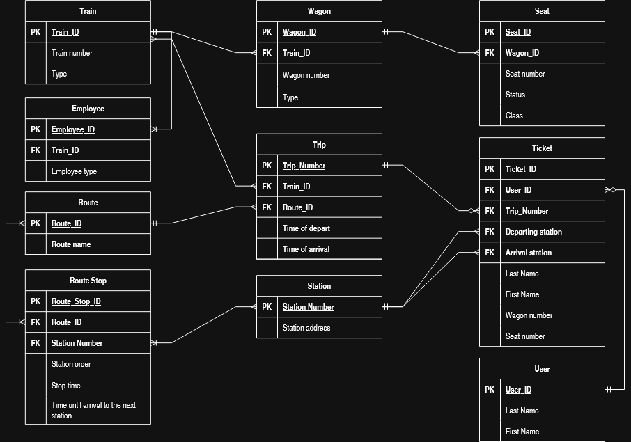
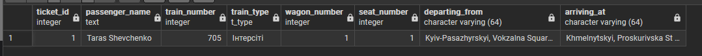
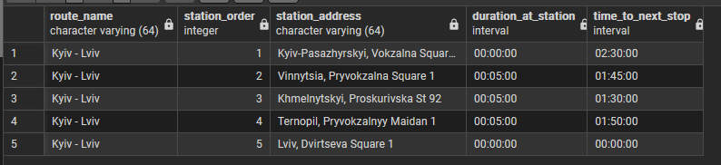

# Зайцев Антон ІО-46 Лабороторна Робота №2 з дисципліни Організація Баз Даних

---

## Цілі

- Написати SQL DDL-інструкції для створення кожної таблиці з вашої ERD в PostgreSQL.
- Вказати відповідні типи даних для кожного стовпця, вибрати первинний ключ для кожної таблиці та визначити будь-які необхідні зовнішні ключі, обмеження UNIQUE, NOT NULL, CHECK або DEFAULT.
- Вставити зразки рядків (принаймні 3–5 рядків на таблицю) за допомогою `INSERT INTO`.
- Протестувати все в pgAdmin (або іншому клієнті PostgreSQL), щоб переконатися, що таблиці та дані завантажуються правильно.

---

## Виконання лабороторної роботи

Використовуємо наступну діаграмму для побудови:


### create-script

```sql
CREATE TYPE t_type AS ENUM ('Інтерсіті', 'Нічний', 'Приміський');

CREATE TABLE IF NOT EXISTS Train (
	train_id SERIAL PRIMARY KEY,
	train_number INT UNIQUE NOT NULL, -- Train number can't be repeating, creates confusion for everyone
	train_type t_type NOT NULL
);

CREATE TYPE w_type AS ENUM ('Купейний', 'Плацкартний', 'Спальний', 'Сидячий', 'Люкс', 'Спеціальний');

CREATE TABLE IF NOT EXISTS Wagon (
	wagon_id SERIAL PRIMARY KEY,
	train_id INT NOT NULL REFERENCES Train(train_id),
	wagon_number INT NOT NULL,
	wagon_type w_type NOT NULL,
	UNIQUE (train_id, wagon_number) -- A train cannot have wagons with same number
);

CREATE TYPE status AS ENUM ('Заброньоване', 'Вільне');
CREATE TYPE s_class AS ENUM ('1-й Клас', '2-й Клас');

-- Not all trains can have classes for their seats, thus not necessary for it to be NOT NULL
CREATE TABLE IF NOT EXISTS Seat (
	seat_id SERIAL PRIMARY KEY,
	wagon_id INT NOT NULL REFERENCES Wagon(wagon_id),
	seat_number INT NOT NULL,
	seat_class s_class,
	seat_status status NOT NULL,
	UNIQUE (wagon_id, seat_number) -- Same as in wagon with trains
);

CREATE TYPE employee_enum AS ENUM ('Борт-Провідник', 'Водій');

CREATE TABLE IF NOT EXISTS Employee (
	employee_id SERIAL PRIMARY KEY,
	train_id INT NOT NULL REFERENCES Train(train_id),
	employee_type employee_enum NOT NULL
);

CREATE TABLE IF NOT EXISTS Station(
	station_number SERIAL PRIMARY KEY,
	station_address VARCHAR(64) NOT NULL
);

CREATE TABLE IF NOT EXISTS Route (
	route_id SERIAL PRIMARY KEY,
	route_name VARCHAR(64) UNIQUE NOT NULL
);

-- Intervals since it's a relative time, not set time like for example 14:00
CREATE TABLE IF NOT EXISTS Route_Stop (
	route_stop_id SERIAL PRIMARY KEY,
	route_id INT NOT NULL REFERENCES Route(route_id),
	station_number INT NOT NULL REFERENCES Station(station_number),
	station_order INT NOT NULL,
	stop_time INTERVAL NOT NULL,
	until_next_station_time INTERVAL NOT NULL,
	UNIQUE (route_id, station_number),
	UNIQUE (route_id, station_order) -- No same stations in one route
);

CREATE TABLE IF NOT EXISTS Client_User (
	user_id SERIAL PRIMARY KEY,
	last_name VARCHAR(32) NOT NULL,
	first_name VARCHAR(32) NOT NULL
);

-- trip_number is a manual input field
CREATE TABLE IF NOT EXISTS Trip (
	trip_number INT PRIMARY KEY,
	train_id INT NOT NULL REFERENCES Train(train_id),
	route_id INT NOT NULL REFERENCES Route(route_id),
	time_of_depart TIMESTAMP NOT NULL,
	time_of_arrival TIMESTAMP NOT NULL
);

CREATE EXTENSION IF NOT EXISTS btree_gist;

CREATE TABLE IF NOT EXISTS Ticket (
    ticket_id SERIAL PRIMARY KEY,
    user_id INT NOT NULL REFERENCES Client_User(user_id),
    trip_number INT NOT NULL REFERENCES Trip(trip_number),
    departing_station INT NOT NULL REFERENCES Station(station_number),
    arrival_station INT NOT NULL REFERENCES Station(station_number),
	
    departing_order INT NOT NULL, 
    arrival_order INT NOT NULL,   
	
    last_name VARCHAR(32) NOT NULL,
    first_name VARCHAR(32) NOT NULL,
    wagon_number INT NOT NULL,
    seat_number INT NOT NULL,

	-- Preventing duplicate tickets for the same place, 
	-- but allowing different tickets to have the same arrival and departing stations
    EXCLUDE USING gist (
        trip_number WITH =,
        wagon_number WITH =,
        seat_number WITH =,
        int4range(departing_order, arrival_order) WITH &&
    )
);
```

### insert-script

```sql
INSERT INTO Train (train_number, train_type) VALUES 
(705, 'Інтерсіті'),
(101, 'Нічний'),
(808, 'Приміський');

INSERT INTO Wagon (train_id, wagon_number, wagon_type) VALUES 
(1, 1, 'Сидячий'),
(1, 2, 'Сидячий'),
(2, 1, 'Купейний'),
(2, 2, 'Плацкартний'),
(3, 1, 'Сидячий');

INSERT INTO Seat (wagon_id, seat_number, seat_class, seat_status) VALUES 
(1, 1, '1-й Клас', 'Вільне'),        
(1, 2, '1-й Клас', 'Заброньоване'),  
(3, 15, NULL, 'Вільне'),             
(4, 42, NULL, 'Вільне'),             
(5, 10, NULL, 'Вільне');             

INSERT INTO Employee (train_id, employee_type) VALUES 
(1, 'Водій'),
(1, 'Борт-Провідник'),
(2, 'Борт-Провідник'),
(3, 'Водій');

INSERT INTO Station (station_address) VALUES 
('Kyiv-Pasazhyrskyi, Vokzalna Square 1'),
('Vinnytsia, Pryvokzalna Square 1'),
('Khmelnytskyi, Proskurivska St 92'),
('Ternopil, Pryvokzalnyy Maidan 1'),
('Lviv, Dvirtseva Square 1');

INSERT INTO Route (route_name) VALUES 
('Kyiv - Lviv'),
('Kyiv - Odesa'),
('Lviv - Uzhhorod');

INSERT INTO Route_Stop (route_id, station_number, station_order, stop_time, until_next_station_time) VALUES 
(1, 1, 1, '00:00:00', '02:30:00'), 
(1, 2, 2, '00:05:00', '01:45:00'), 
(1, 3, 3, '00:05:00', '01:30:00'), 
(1, 4, 4, '00:05:00', '01:50:00'), 
(1, 5, 5, '00:00:00', '00:00:00'); 

INSERT INTO Client_User (last_name, first_name) VALUES 
('Shevchenko', 'Taras'),
('Franko', 'Ivan'),
('Ukrainka', 'Lesya'),
('Kostenko', 'Lina');

INSERT INTO Trip (trip_number, train_id, route_id, time_of_depart, time_of_arrival) VALUES 
(1001, 1, 1, '2026-03-25 06:00:00', '2026-03-25 13:45:00'),
(1002, 2, 1, '2026-03-26 22:00:00', '2026-03-27 06:00:00'),
(1003, 3, 1, '2026-03-27 08:00:00', '2026-03-27 15:30:00');

INSERT INTO Ticket (user_id, trip_number, departing_station, arrival_station, departing_order, arrival_order, last_name, first_name, wagon_number, seat_number) VALUES 
(1, 1001, 1, 3, 1, 3, 'Shevchenko', 'Taras', 1, 1),
(2, 1001, 3, 5, 3, 5, 'Franko', 'Ivan', 1, 1),
(3, 1001, 2, 4, 2, 4, 'Ukrainka', 'Lesya', 1, 2),
(4, 1002, 1, 5, 1, 5, 'Kostenko', 'Lina', 1, 15);
```

### First SELECT query

```sql
SELECT 
    t.ticket_id,
    cu.first_name || ' ' || cu.last_name AS passenger_name,
    tr.train_number,
    tr.train_type,
    t.wagon_number,
    t.seat_number,
    dep_station.station_address AS departing_from,
    arr_station.station_address AS arriving_at
FROM Ticket t
JOIN Client_User cu ON t.user_id = cu.user_id
JOIN Trip trip ON t.trip_number = trip.trip_number
JOIN Train tr ON trip.train_id = tr.train_id
JOIN Station dep_station ON t.departing_station = dep_station.station_number
JOIN Station arr_station ON t.arrival_station = arr_station.station_number
WHERE cu.user_id = 1; -- Find tickets for Taras Shevchenko
```

Результат:



### Second  SELECT query

```sql
SELECT 
    t.ticket_id,
    t.first_name || ' ' || t.last_name AS passenger,
    t.departing_order,
    t.arrival_order,
    int4range(t.departing_order, t.arrival_order) AS occupied_range
FROM Ticket t
WHERE t.trip_number = 1001 
  AND t.wagon_number = 1 
  AND t.seat_number = 1
ORDER BY t.departing_order ASC;
```

Результат:


## Структура

> Train
>>  Початкова таблиця, з якої йдуть всі основні зв'язки, номера поїздів не можуть повторятися. Номер та тип

> Wagon
>>  Вагони пов'язані з поіздами, зберігають номер та тип. Не може бути дуплікатів номеру до одного й самого потягу

> Seat
>>  Мають статус бронювання та клас сидіння. Сидіння не обов'язково має мати клас, також унікальний номер щодо вагону

> Employee
>>	Прив'язані до потягу та мають свій енумератор посади 

> Station
>>	Унікальні та мають обов'язкову адрессу в собі

> Route
>>	Унікальні напрямки 

> Route_Stop
>>	Складаються зі впорядкованих станцій, мають в собі час зупинки та час поїздки до наступної станції

> Client_User
>> Таблция користувача. Зберігає прізвище та ім'я

> Trip
>>	Індивідуальна поїздка в конкретну дату за взиначеним напрямком. Дата відбуття та прибуття, поізд прив'язаний до неї та напрямок

> Ticket
>>	Два квитки за одним напрямком можуть мати однакову станцію відбуття та прибуття (Тобто пасажир 1 вийде на станції А, а пасажир 2 на ній сяде). Зберігаємо дату, станції на котрій пасажир сяде та вийде, номер поїздки, номер вагону та місця, та також прізвище, та ім'я пасажира
